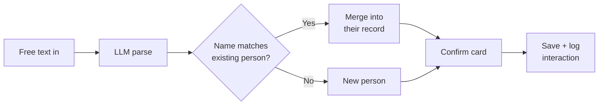
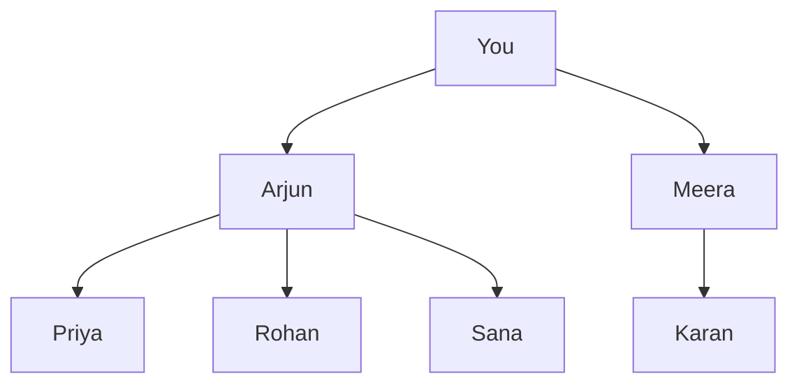

# Personal CRM — Feature Spec

2026-09-19 · @Someone

## Overview and goals

A personal CRM for remembering people properly and staying in touch deliberately rather than by accident.

Three jobs it has to do:

1. **Capture** — log someone within seconds of meeting them, including the soft details (spouse's name, the cat, where they grew up) that make a later follow-up feel personal rather than transactional.
2. **Recall** — pull up everything known about a person before a call, a coffee or a conference.
3. **Nudge** — surface who is overdue for contact and whose birthday is near, so relationships don't quietly lapse.

Guiding principle: **capture must be frictionless, review must be batched.** Every feature below is judged against whether it adds friction at capture time. If it does, it moves to an enrichment step or gets cut.

## Data model

Four tables carry everything. Keep structured fields few; let free text hold the rest.

**people**

| Field | Type | Notes |
| --- | --- | --- |
| id | uuid |  |
| name | text | Required — the only mandatory field |
| how\_we\_met | text | Free text: event, place, who introduced |
| company | text | Optional |
| role | text | Optional |
| city | text | Drives trip-based filtering |
| birthday | date, year optional | Many birthdays are known day and month only |
| cadence\_days | integer | Null means no nudging for this person |
| notes | long text | Spouse, kids, pets, hobbies, the whole soft layer |
| last\_contacted\_at | date | Denormalised from interactions for fast queries |
| snoozed\_until | date | Suppresses nudges without deleting the cadence |
| created\_at | timestamp |  |

**interactions**

| Field | Type | Notes |
| --- | --- | --- |
| id | uuid |  |
| person\_id | uuid | Foreign key to people |
| occurred\_on | date | Date only; time adds nothing here |
| channel | text | met, call, message, email |
| summary | text | One or two sentences |

**tags** and **people\_tags**

A simple many-to-many. Tag has an id, a name and an optional kind (context, industry, city, strength).

**introductions**

| Field | Type | Notes |
| --- | --- | --- |
| person\_id | uuid | The person you met |
| introduced\_by\_id | uuid | Who made the introduction |
| occurred\_on | date | Optional |

That last table is a directed edge list. It is all the graph you need.

## Capture flow

One text box, no form. You type or dictate a sentence and a model turns it into fields.

Example input: *met Priya at the Bangalore fintech meetup, she runs growth at a lending startup, has a cat called Mango, Arjun introduced us.*

What the parser returns: name Priya, company a lending startup, role growth, city Bangalore, how\_we\_met the fintech meetup, introduced\_by Arjun, notes the cat called Mango, tags fintech and meetup.



**Confirmation UX.** The parse returns a compact card with the extracted fields editable inline. One tap to save. Never block on a missing field — name alone is a valid record.

**Quick-log.** A second, lighter path for people already in the system. Open a person, tap Log, type a sentence, done. This writes an interaction and resets their overdue clock.

**Edge cases worth handling early**

- **Ambiguous names.** Two people called Rahul. Show both candidates with a distinguishing detail (company, city) and a Create new option.
- **Partial birthdays.** Accept day and month with no year; store year as null rather than guessing.
- **Relative dates.** "Met her last Tuesday" should resolve against the capture date, not default to today.
- **Bulk paste.** A conference badge dump or a list of names pasted at once should split into several records rather than one.

## Nudge logic

Every person carries a cadence in days. A nightly job computes who is overdue and by how much.

**Suggested cadence tiers**

| Tier | Days | Who it fits |
| --- | --- | --- |
| Close | 30 | Close friends, key collaborators |
| Active | 90 | People you want to keep warm |
| Loose | 180 | Good contacts, low frequency |
| Dormant | 365 | Annual check-in only |
| None | null | Never nudge |

Default new contacts to 90 days. Let it be changed from the person's page in one tap.

**Overdue calculation**

```latex
days\_overdue = (today - last\_contacted\_at) - cadence\_days
```

Anyone with days\_overdue greater than zero is eligible, unless snoozed\_until is in the future. If last\_contacted\_at is null, fall back to created\_at so a newly added person still enters the cycle.

**Birthday lookahead**

A person surfaces when their birthday falls within the next fourteen days. Compare day and month only, and handle the year wrap around December and January. February 29 rolls to March 1 in non-leap years.

**Priority scoring**

Rather than showing everyone overdue, score them and take the top few:

```latex
score = \frac{days\_overdue}{cadence\_days} + 2 \cdot birthday\_soon + 0.5 \cdot recently\_added
```

The first term normalises urgency, so someone thirty days past a thirty-day cadence outranks someone thirty days past a year-long one. Birthdays get a strong boost because they are time-sensitive and easy to act on. New contacts get a small boost, since the first follow-up after meeting matters most.

**Dampening rules**

- Never show the same person in two consecutive digests unless it is their birthday.
- Cap at one nudge per person per thirty days regardless of score.
- Dismissing a nudge snoozes that person for half their cadence.

## Weekly digest

One email or push every Monday morning with five people. One decision point per week beats fifteen interruptions.

**Composition**

| Slot | Source | Rule |
| --- | --- | --- |
| 1–2 | Birthdays | Anyone with a birthday in the next fourteen days |
| 3–4 | Overdue | Highest priority score |
| 5 | Wildcard | Random person not contacted in over a year |

If there are no birthdays that week, overdue contacts fill those slots. The wildcard slot exists to resurface the long tail, which cadence-based logic tends to bury.

**What each entry shows**

Name, how you met, the last interaction and its date, and one soft detail pulled from notes. That detail is the whole point — it gives you an opening line instead of a blank message box.

**Actions per entry**

- **Log it** — records an interaction and resets the clock.
- **Snooze** — pushes the person out by half their cadence.
- **Change cadence** — inline, for when the tier was wrong.
- **Not now** — drops them from this week only.

**Delivery.** Email is enough to start. Send early Monday in the recipient's timezone. If three consecutive digests go unopened, drop to fortnightly automatically rather than continuing to shout into a void.

## Tags and filtering

Cheap to build, disproportionate payoff. Tags are what turn a list of names into something you can query before an event.

**Four kinds worth separating**

| Kind | Examples | Why |
| --- | --- | --- |
| Context | meetup, ex-colleague, college, client | How you know them |
| Industry | fintech, legal, design, hiring | Who to connect to whom |
| City | Bangalore, Mumbai, Dubai | Trip planning |
| Strength | close, warm, cold | Rough relationship temperature |

**Use cases these unlock**

- Before a conference: everyone tagged fintech who you haven't spoken to in six months.
- Before a trip home: everyone tagged Mumbai, sorted by how overdue they are.
- When hiring: everyone tagged design, regardless of cadence.
- When making an introduction: two people sharing an industry tag but no introduction edge between them.

**Keep the taxonomy loose.** Let the parser invent tags freely at capture time and merge near-duplicates later in a small cleanup view. Forcing a fixed vocabulary up front is the fastest way to stop using the system.

**Saved views.** Any filter combination can be saved and named. In practice you'll end up with three or four you use constantly, and those become the real home screen.

## Relationship mapping

One field at capture time — who introduced us — builds a graph that tells you something no contact list can.



Here Arjun is a connector node: three of your contacts arrived through him. That is worth knowing, because connectors are the people whose relationship compounds.

**What to compute**

- **Introduction count** — how many people each contact brought you. Sort descending and you have your connectors.
- **Orphans** — people with no introduction edge, met cold. These tend to lapse fastest and deserve tighter cadence.
- **Second-degree reach** — for any contact, who they could plausibly introduce you to, based on shared tags.

**How it surfaces**

Don't build a full graph visualisation first. Start with a ranked list of connectors on the home screen, and an Introduced by line on each person's page linking back. The visual graph is a nice-to-have that looks impressive and gets used twice.

**Reciprocity prompt.** If someone has introduced you to three or more people and you have introduced them to none, the digest can flag it. Networks run on returning favours.

## Build order and stack

Ship the capture loop first. A CRM with great nudges and no data in it is worth nothing.

| Phase | Scope | Done when |
| --- | --- | --- |
| 1 | people table, free-text capture with LLM parse, person page | You can add someone in under ten seconds |
| 2 | interactions, quick-log, last\_contacted\_at | Every contact has a history |
| 3 | cadence, overdue job, weekly digest email | You get your first Monday list |
| 4 | tags, saved views | You can filter before a trip |
| 5 | introductions, connector ranking | You know who your connectors are |

**Stack notes for vibe coding**

- Postgres via Supabase or Neon. The relational shape here is genuinely relational — don't reach for a document store.
- Next.js on Vercel, or plain server-rendered if you want less to think about.
- A cron job for the nightly overdue computation. Vercel cron or a Supabase scheduled function both work.
- Resend or Postmark for the digest email. Plain HTML, no template framework.
- Structured output mode on the parse call, with a strict JSON schema matching the people table. This is the one place worth spending time on the prompt.

**A warning.** The parse step is where quality lives and where it breaks. Log every raw input alongside its parsed output from day one, so when it gets something wrong you can see exactly what it saw.
